

  

# SeekScape App

A unique travel-sharing platform designed to connect
travelers and create shared experiences.

## App features

- **Travel Sharing**: Users can post their planned trips and invite others to join.
- **Travel Managing**: Users can manage trips they’ve created and view trips they've applied to. These are
  organized as `upcoming`, `pending`, `rejected`, `to review` and `past` for clarity and easy tracking.
- **Advanced Filtering & Search**: Users can find trips by destination, dates, or interests quickly.
- **Travel Reviews**: After a trip, users can leave detailed feedback about both the trip and the travel
  companions to help future travelers.
- **Notifications**: Keeps users informed about travel updates and new messages.
- **Travel Chat**: Dedicated group chats for each travel plan to coordinate details and build rapport.
- **Dark mode**: A sleek, mood-conscious design for comfortable use at all hours.
- **Notification Management**: Users can customize which alerts they want to receive.

## Firebase

The project used the free tier of **Firebase** as its backend.  
More information about the structure can be found [here](./docs/Firestore_DB_structure.md), and about the console [here](./docs/Firebase_Console.md).

## App screens

screenshots made from android phone
 
android 14, OnePlus Nord 2T 5G (6,43 pollici)

### Auth

<table>
  <tr>
    <td style="text-align:center; padding:8px;">
      <figcaption style="font-size: 1.1em; font-style: italic;">Sign in</figcaption>
      
    </td>
    <td style="text-align:center; padding:8px;">
      <figcaption style="font-size: 1.1em; font-style: italic;">Sign up</figcaption>
      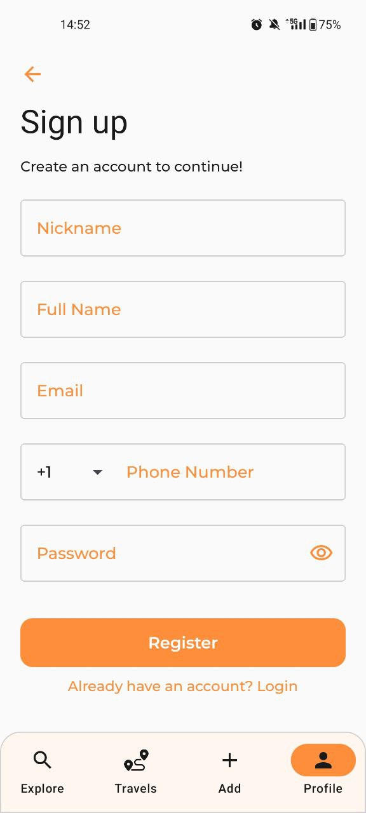
    </td>
    <td></td>
  </tr>
</table>

### Explore Tab

<table>
  <tr>
    <td style="text-align:center; padding:8px;">
      <figcaption style="font-size: 1.1em; font-style: italic;">Explore</figcaption>
      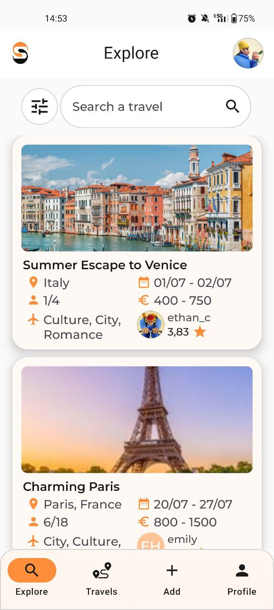
    </td>
    <td style="text-align:center; padding:8px;">
      <figcaption style="font-size: 1.1em; font-style: italic;">Filters</figcaption>
      
    </td>
    <td style="text-align:center; padding:8px;">
      <figcaption style="font-size: 1.1em; font-style: italic;">Explore travel</figcaption>
      
    </td>
  </tr>
  <tr>
    <td style="text-align:center; padding:8px;">
      <figcaption style="font-size: 1.1em; font-style: italic;">Explore travel</figcaption>
      
    </td>
    <td style="text-align:center; padding:8px;">
      <figcaption style="font-size: 1.1em; font-style: italic;">Explore travel itinerary</figcaption>
      
    </td>
    <td style="text-align:center; padding:8px;">
      <figcaption style="font-size: 1.1em; font-style: italic;">Explore travel images</figcaption>
      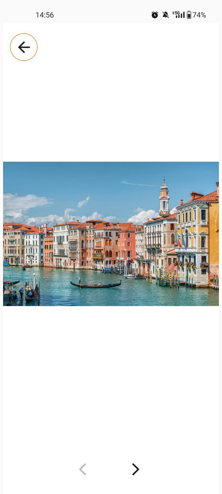
    </td>

  </tr>
  <tr>
    <td style="text-align:center; padding:8px;">
      <figcaption style="font-size: 1.1em; font-style: italic;">Apply to join</figcaption>
      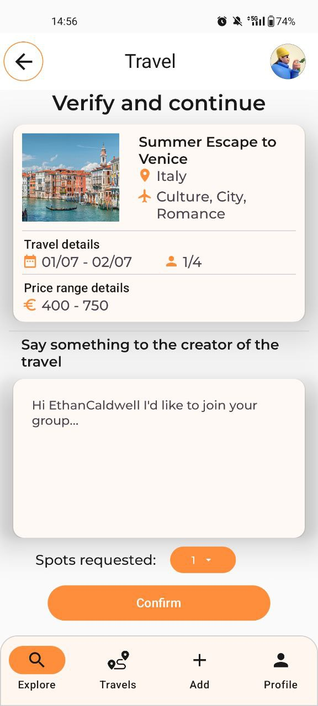
    </td>
    <td style="text-align:center; padding:8px;">
      <figcaption style="font-size: 1.1em; font-style: italic;">View profile</figcaption>
      
    </td>
    <td style="text-align:center; padding:8px;">
      <figcaption style="font-size: 1.1em; font-style: italic;">View profile review</figcaption>
      
    </td>
  </tr>
</table>

### Travels Tab

#### Explorer Mode

<table>
  <tr>
    <td style="text-align:center; padding:8px;">
      <figcaption style="font-size: 1.1em; font-style: italic;">Travels upcoming</figcaption>
      
    </td>
    <td style="text-align:center; padding:8px;">
      <figcaption style="font-size: 1.1em; font-style: italic;">Travel upcoming view</figcaption>
      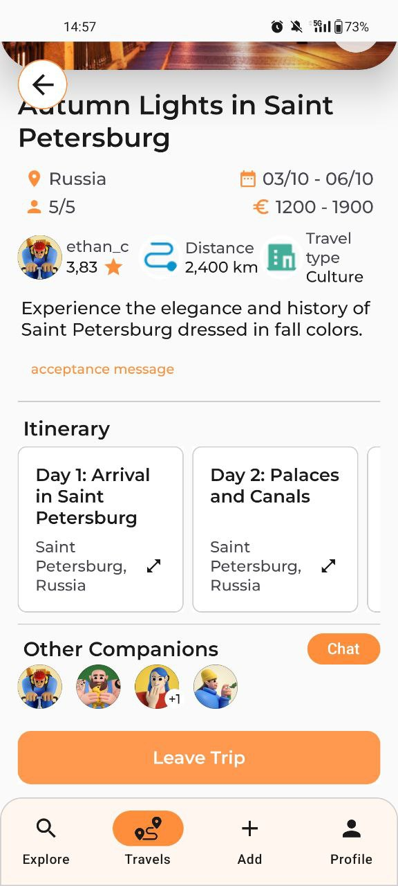
    </td>
    <td style="text-align:center; padding:8px;">
      <figcaption style="font-size: 1.1em; font-style: italic;">Travel upcoming view msg</figcaption>
      
    </td>
  </tr>
  <tr>
    <td style="text-align:center; padding:8px;">
      <figcaption style="font-size: 1.1em; font-style: italic;">Travels pending</figcaption>
      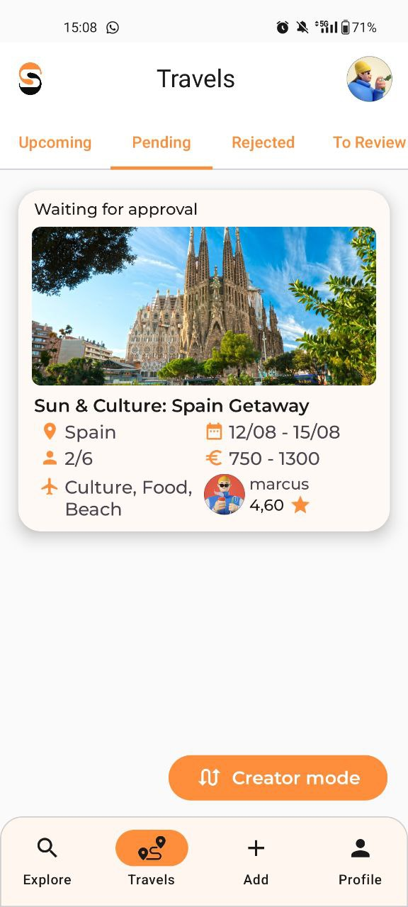
    </td>
    <td style="text-align:center; padding:8px;">
      <figcaption style="font-size: 1.1em; font-style: italic;">Travel pending view</figcaption>
      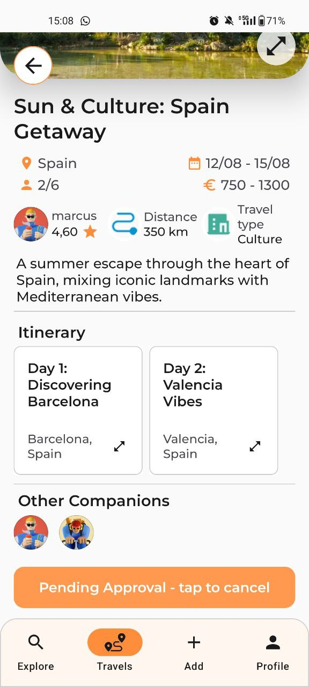
    </td>
    <td style="text-align:center; padding:8px;">
      <figcaption style="font-size: 1.1em; font-style: italic;">Travels rejected</figcaption>
      
    </td>
  </tr>
  <tr>
    <td style="text-align:center; padding:8px;">
      <figcaption style="font-size: 1.1em; font-style: italic;">Travel rejected view</figcaption>
      
    </td>
    <td style="text-align:center; padding:8px;">
      <figcaption style="font-size: 1.1em; font-style: italic;">Travels to review</figcaption>
      
    </td>
    <td style="text-align:center; padding:8px;">
      <figcaption style="font-size: 1.1em; font-style: italic;">Review travel</figcaption>
      
    </td>
  </tr>
  <tr>
    <td style="text-align:center; padding:8px;">
      <figcaption style="font-size: 1.1em; font-style: italic;">Review travel</figcaption>
      
    </td>
    <td style="text-align:center; padding:8px;">
      <figcaption style="font-size: 1.1em; font-style: italic;">Review organizer</figcaption>
      
    </td>
    <td style="text-align:center; padding:8px;">
      <figcaption style="font-size: 1.1em; font-style: italic;">Review companion</figcaption>
      
    </td>
  </tr>
  <tr>
    <td style="text-align:center; padding:8px;">
      <figcaption style="font-size: 1.1em; font-style: italic;">Travels past</figcaption>
      
    </td>
    <td style="text-align:center; padding:8px;">
      <figcaption style="font-size: 1.1em; font-style: italic;">Travel past view</figcaption>
      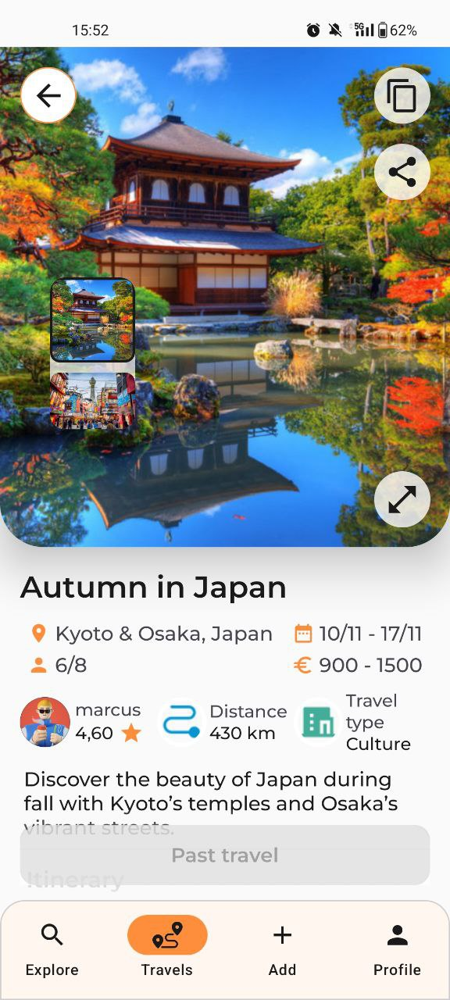
    </td>
    <td style="text-align:center; padding:8px;">
      <figcaption style="font-size: 1.1em; font-style: italic;">Travel past view review</figcaption>
      
    </td>
  </tr>
</table>

#### Creator Mode

<table>
  <tr>
    <td style="text-align:center; padding:8px;">
      <figcaption style="font-size: 1.1em; font-style: italic;">Travels my trips</figcaption>
      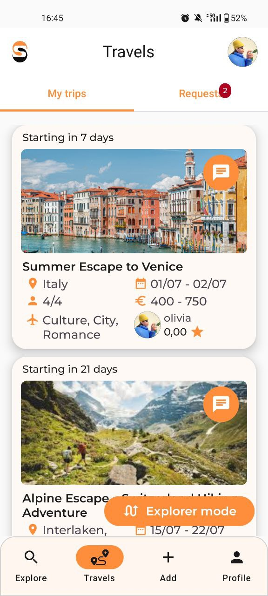
    </td>
    <td style="text-align:center; padding:8px;">
      <figcaption style="font-size: 1.1em; font-style: italic;">Travel my trip view</figcaption>
      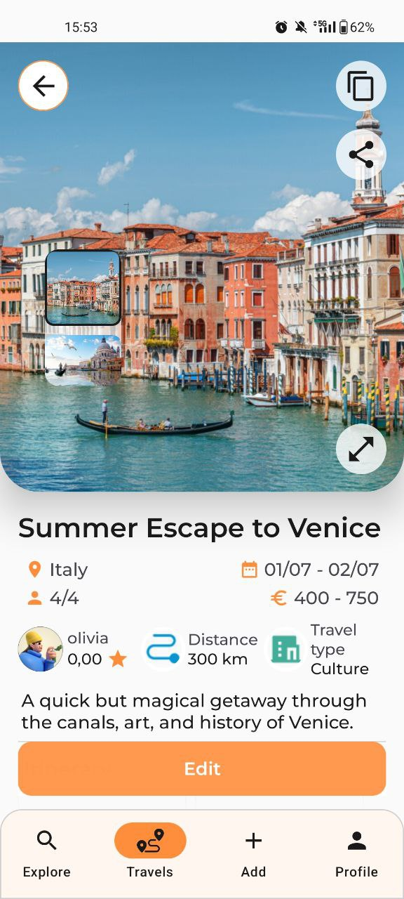
    </td>
    <td style="text-align:center; padding:8px;">
      <figcaption style="font-size: 1.1em; font-style: italic;">Travel my trip edit</figcaption>
      
    </td>
  </tr>
  <tr>
    <td style="text-align:center; padding:8px;">
      <figcaption style="font-size: 1.1em; font-style: italic;">Travel my trip delete</figcaption>
      
    </td>
    <td style="text-align:center; padding:8px;">
      <figcaption style="font-size: 1.1em; font-style: italic;">Travels requests</figcaption>
      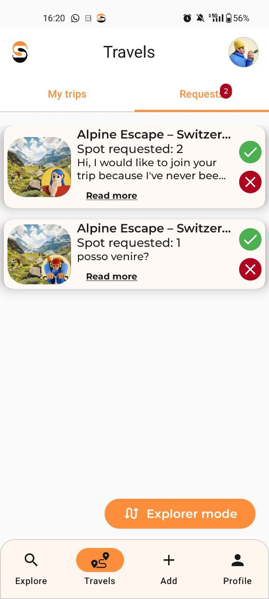
    </td>
    <td style="text-align:center; padding:8px;">
      <figcaption style="font-size: 1.1em; font-style: italic;">Travel request view</figcaption>
      
    </td>
  </tr>
  <tr>
    <td style="text-align:center; padding:8px;">
      <figcaption style="font-size: 1.1em; font-style: italic;">Travel request accept</figcaption>
      
    </td>
  </tr>
</table>

### Add travel proposal Tab

<table>
  <tr>
    <td style="text-align:center; padding:8px;">
      <figcaption style="font-size: 1.1em; font-style: italic;">Add travel</figcaption>
      
    </td>
    <td style="text-align:center; padding:8px;">
      <figcaption style="font-size: 1.1em; font-style: italic;">Add travel</figcaption>
      
    </td>
    <td style="text-align:center; padding:8px;">
      <figcaption style="font-size: 1.1em; font-style: italic;">Add travel</figcaption>
      
    </td>
  </tr>
  <tr>
    <td style="text-align:center; padding:8px;">
      <figcaption style="font-size: 1.1em; font-style: italic;">add itinerary</figcaption>
      
    </td>
    <td style="text-align:center; padding:8px;">
      <figcaption style="font-size: 1.1em; font-style: italic;">add itinerary</figcaption>
      
    </td>
    <td style="text-align:center; padding:8px;">
      <figcaption style="font-size: 1.1em; font-style: italic;">add activity</figcaption>
      
    </td>
  </tr>
</table>

### Profile Tab

<table>
  <tr>
    <td style="text-align:center; padding:8px;">
      <figcaption style="font-size: 1.1em; font-style: italic;">Profile tab</figcaption>
      
    </td>
    <td style="text-align:center; padding:8px;">
      <figcaption style="font-size: 1.1em; font-style: italic;">Profile dark mode</figcaption>
      
    </td>
    <td style="text-align:center; padding:8px;">
      <figcaption style="font-size: 1.1em; font-style: italic;">Profile notifications</figcaption>
      
    </td>
  </tr>
  <tr>
    <td style="text-align:center; padding:8px;">
      <figcaption style="font-size: 1.1em; font-style: italic;">Profile edit</figcaption>
      
    </td>
    <td style="text-align:center; padding:8px;">
      <figcaption style="font-size: 1.1em; font-style: italic;">Profile account</figcaption>
      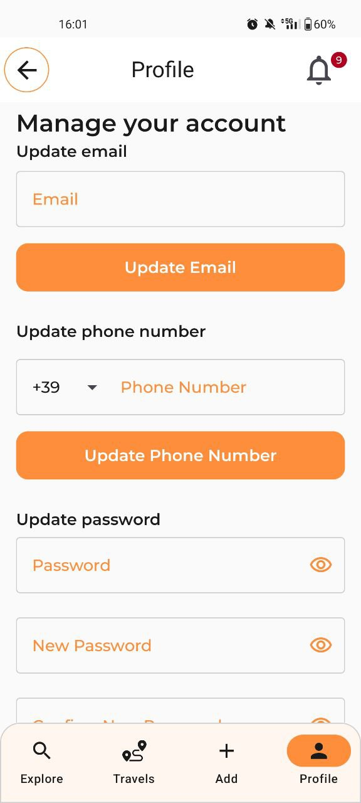
    </td>
    <td style="text-align:center; padding:8px;">
      <figcaption style="font-size: 1.1em; font-style: italic;">Profile notifications</figcaption>
      
    </td>
  </tr>
</table>
