# App Demo 

video and screenshots made from android phone
 
android 14, OnePlus Nord 2T 5G (6,43 pollici)

## App Demonstration Video

<video width="600" controls>
  <source src="./assets/video_app.mp4" type="video/mp4">
</video>
 
 

## App Screens 

### Auth

  <figure style="width:30%; display: inline-block; text-align: center; margin: 0 10px;">
    <figcaption style="font-size: 1.1em; font-style: italic;">Sign in</figcaption>
    
  </figure>
  <figure style="width:30%; display: inline-block; text-align: center; margin: 0 10px;">
    <figcaption style="font-size: 1.1em; font-style: italic;">Sign up</figcaption>
    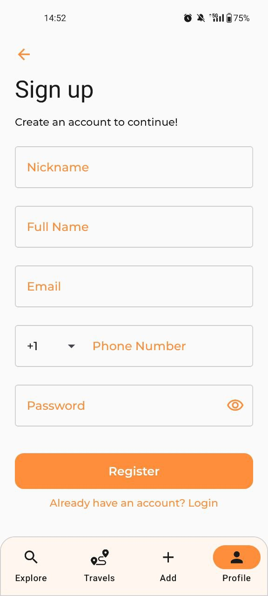
  </figure>

### Eplore Tab

  <figure style="width:30%; display: inline-block; text-align: center; margin: 0 10px;">
    <figcaption style="font-size: 1.1em; font-style: italic;">explore</figcaption>
    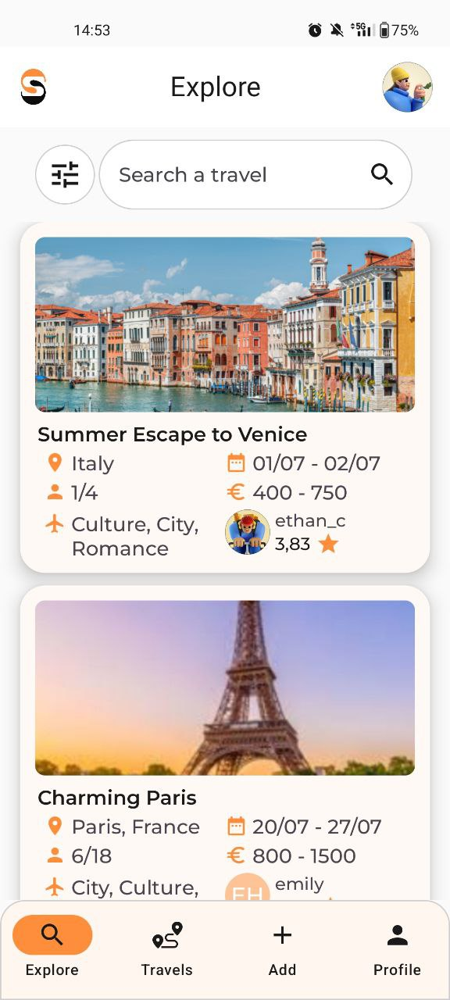
  </figure>
  <figure style="width:30%; display: inline-block; text-align: center; margin: 0 10px;">
    <figcaption style="font-size: 1.1em; font-style: italic;">filters</figcaption>
    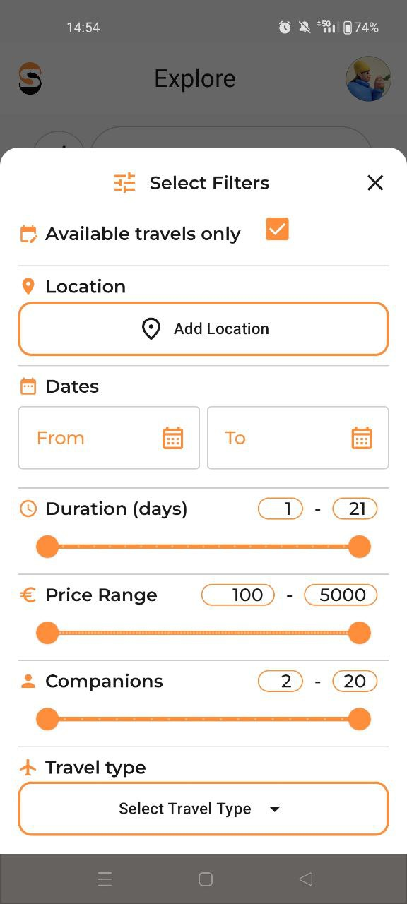
  </figure>

  <figure style="width:30%; display: inline-block; text-align: center; margin: 0 10px;">
    <figcaption style="font-size: 1.1em; font-style: italic;">explore travel</figcaption>
    
  </figure>
  <figure style="width:30%; display: inline-block; text-align: center; margin: 0 10px;">
    <figcaption style="font-size: 1.1em; font-style: italic;">explore travel share</figcaption>
    
  </figure>
  <figure style="width:30%; display: inline-block; text-align: center; margin: 0 10px;">
    <figcaption style="font-size: 1.1em; font-style: italic;">apply to join</figcaption>
    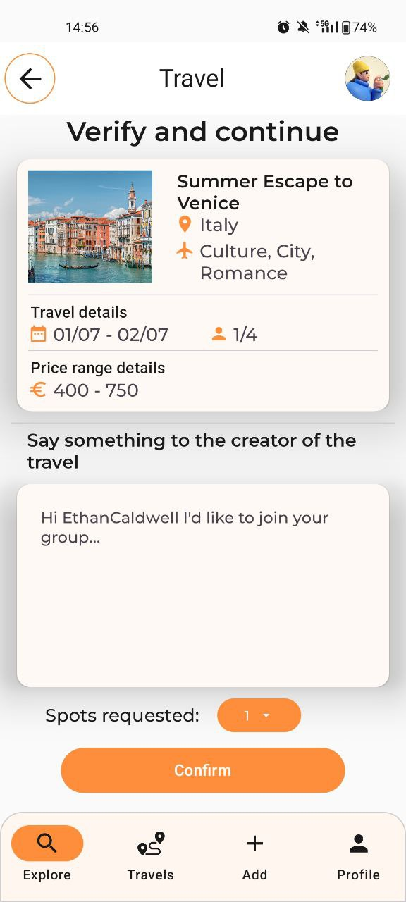
  </figure>

  <figure style="width:30%; display: inline-block; text-align: center; margin: 0 10px;">
    <figcaption style="font-size: 1.1em; font-style: italic;">explore travel itinerary</figcaption>
    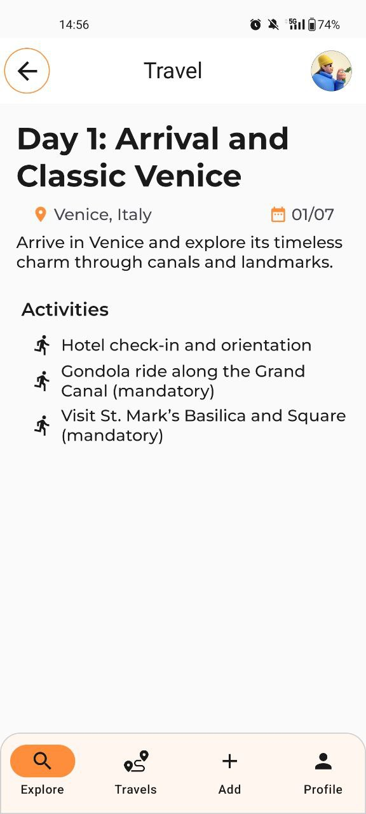
  </figure>
  <figure style="width:30%; display: inline-block; text-align: center; margin: 0 10px;">
    <figcaption style="font-size: 1.1em; font-style: italic;">explore travel images</figcaption>
    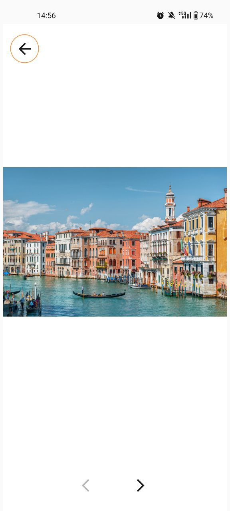
  </figure>

  <figure style="width:30%; display: inline-block; text-align: center; margin: 0 10px;">
    <figcaption style="font-size: 1.1em; font-style: italic;">View profile</figcaption>
    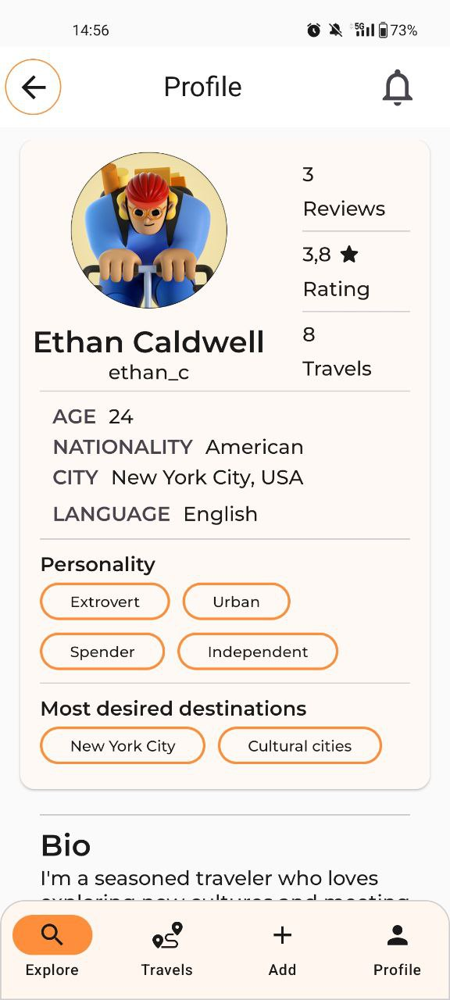
  </figure>
  <figure style="width:30%; display: inline-block; text-align: center; margin: 0 10px;">
    <figcaption style="font-size: 1.1em; font-style: italic;">View profile review</figcaption>
    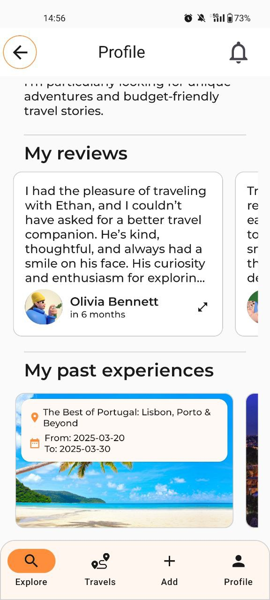
  </figure>

### Travels Tab

#### Explorer Mode

  <figure style="width:30%; display: inline-block; text-align: center; margin: 0 10px;">
    <figcaption style="font-size: 1.1em; font-style: italic;">travels upcoming</figcaption>
    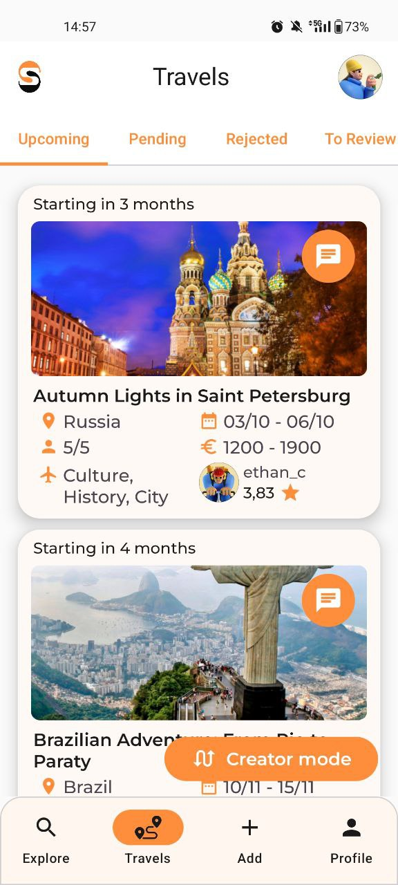
  </figure>
  <figure style="width:30%; display: inline-block; text-align: center; margin: 0 10px;">
    <figcaption style="font-size: 1.1em; font-style: italic;">travel upcoming view</figcaption>
    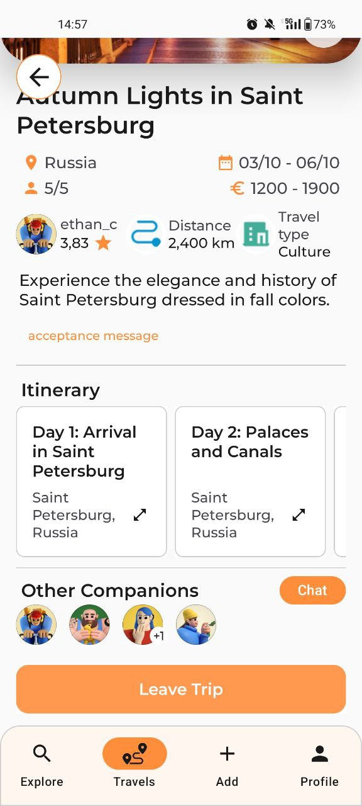
  </figure>
  <figure style="width:30%; display: inline-block; text-align: center; margin: 0 10px;">
    <figcaption style="font-size: 1.1em; font-style: italic;">travel upcoming view msg</figcaption>
    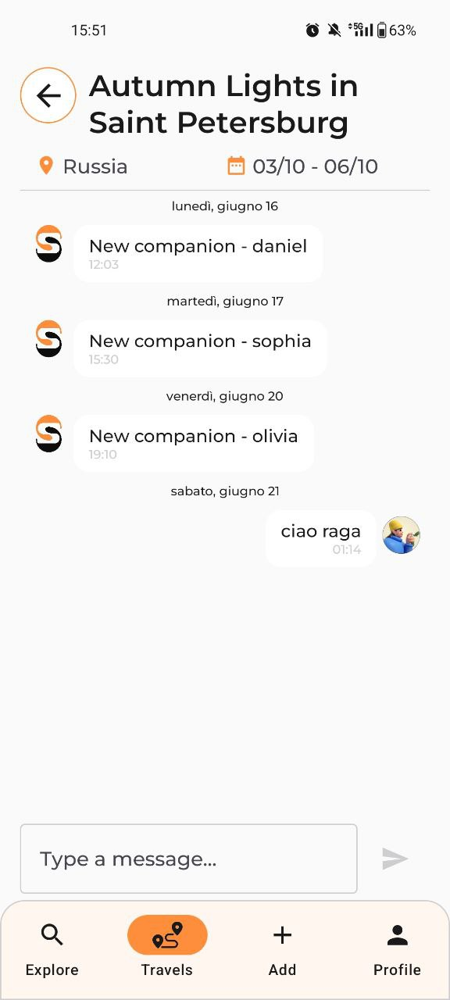
  </figure>

  <figure style="width:30%; display: inline-block; text-align: center; margin: 0 10px;">
    <figcaption style="font-size: 1.1em; font-style: italic;">travels pending</figcaption>
    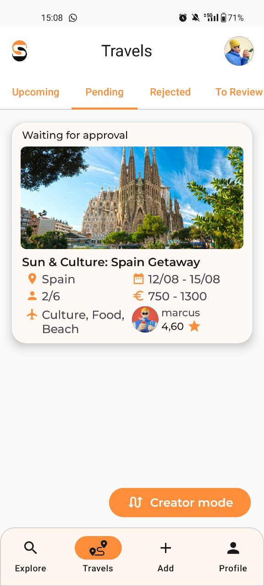
  </figure>
  <figure style="width:30%; display: inline-block; text-align: center; margin: 0 10px;">
    <figcaption style="font-size: 1.1em; font-style: italic;">travel pending view</figcaption>
    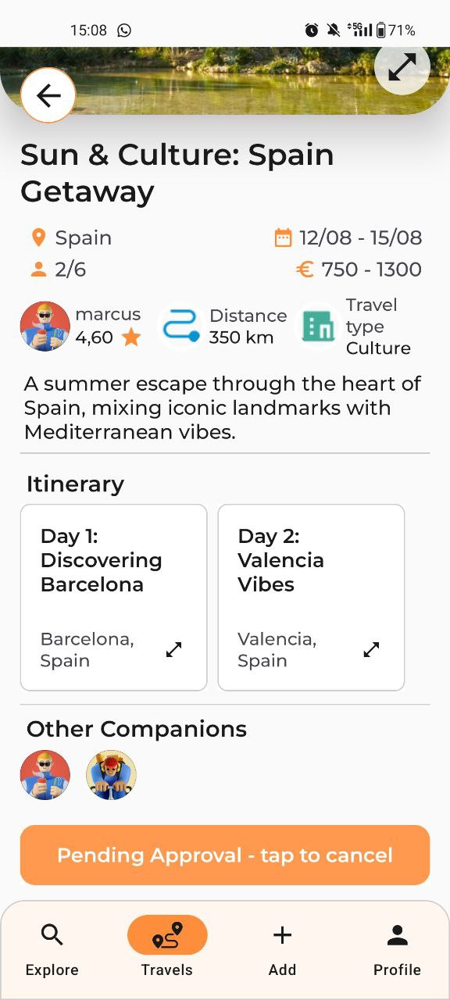
  </figure>

  <figure style="width:30%; display: inline-block; text-align: center; margin: 0 10px;">
    <figcaption style="font-size: 1.1em; font-style: italic;">travels rejected</figcaption>
    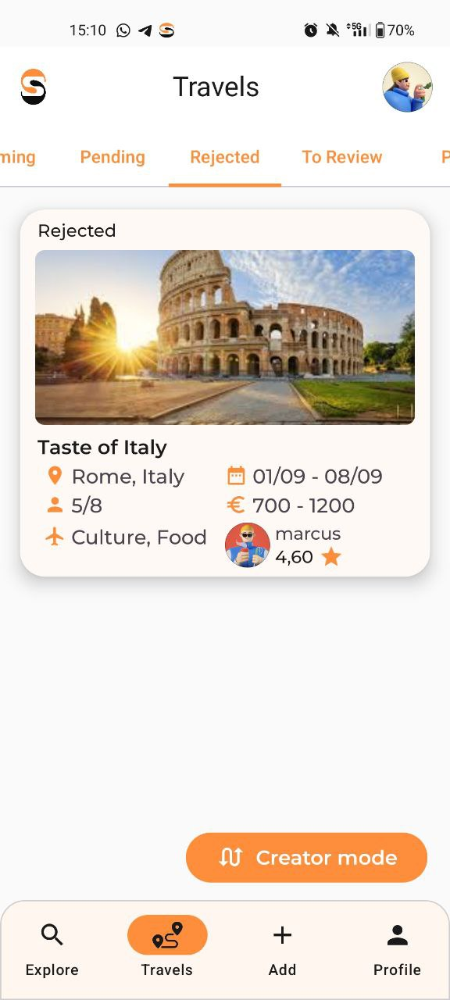
  </figure>
  <figure style="width:30%; display: inline-block; text-align: center; margin: 0 10px;">
    <figcaption style="font-size: 1.1em; font-style: italic;">travel rejected view</figcaption>
    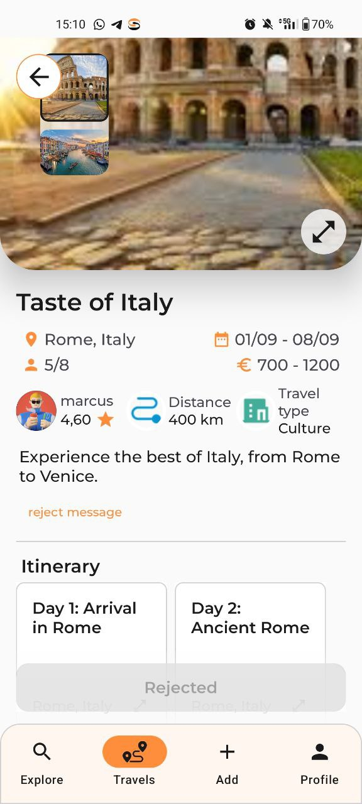
  </figure>

  <figure style="width:30%; display: inline-block; text-align: center; margin: 0 10px;">
    <figcaption style="font-size: 1.1em; font-style: italic;">travels to review</figcaption>
    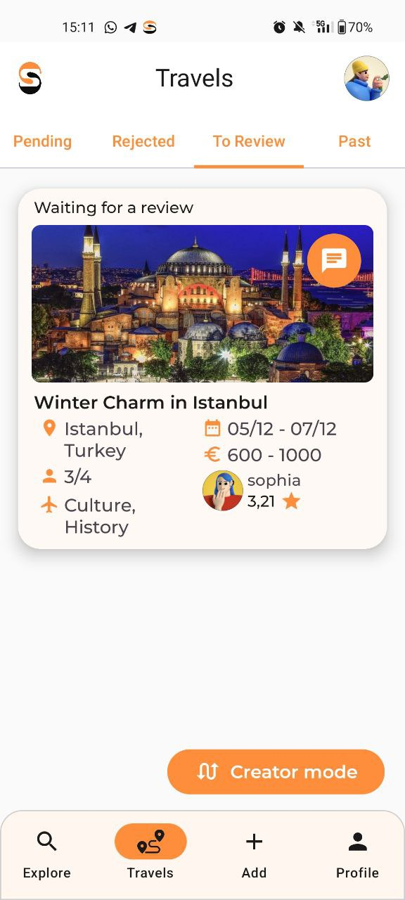
  </figure>
  <figure style="width:30%; display: inline-block; text-align: center; margin: 0 10px;">
    <figcaption style="font-size: 1.1em; font-style: italic;">Review travel</figcaption>
    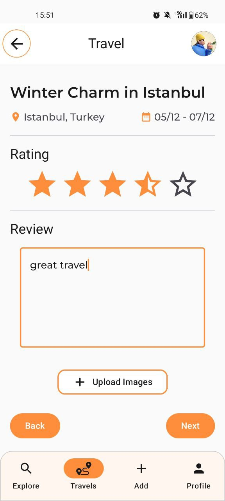
  </figure>
  <figure style="width:30%; display: inline-block; text-align: center; margin: 0 10px;">
    <figcaption style="font-size: 1.1em; font-style: italic;">Review companion</figcaption>
    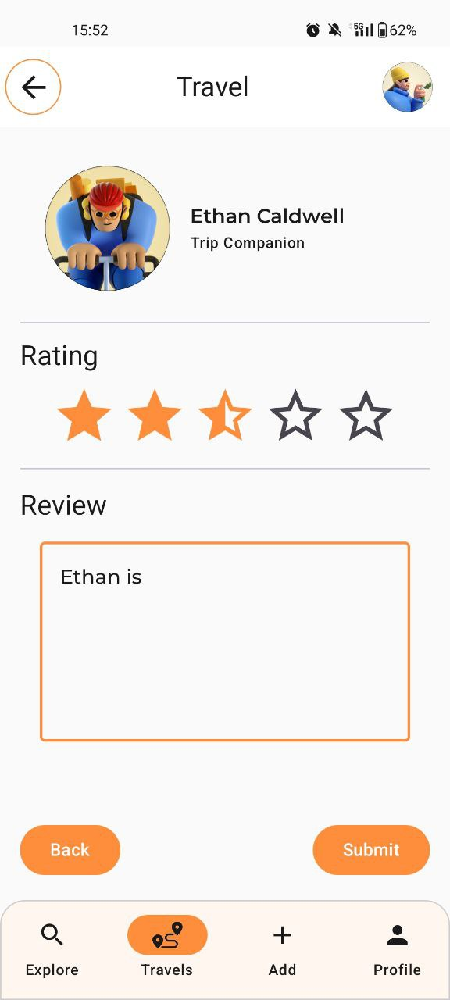
  </figure>

  <figure style="width:30%; display: inline-block; text-align: center; margin: 0 10px;">
    <figcaption style="font-size: 1.1em; font-style: italic;">travels past</figcaption>
    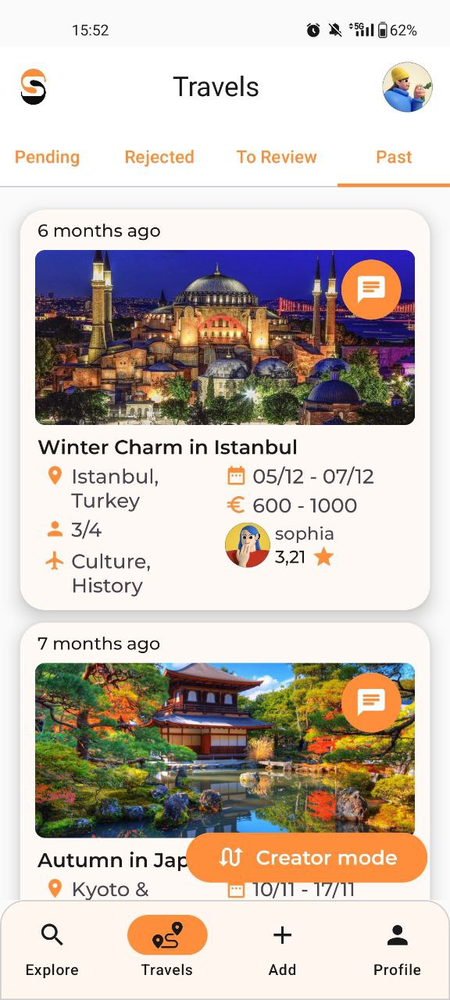
  </figure>
  <figure style="width:30%; display: inline-block; text-align: center; margin: 0 10px;">
    <figcaption style="font-size: 1.1em; font-style: italic;">travel past view</figcaption>
    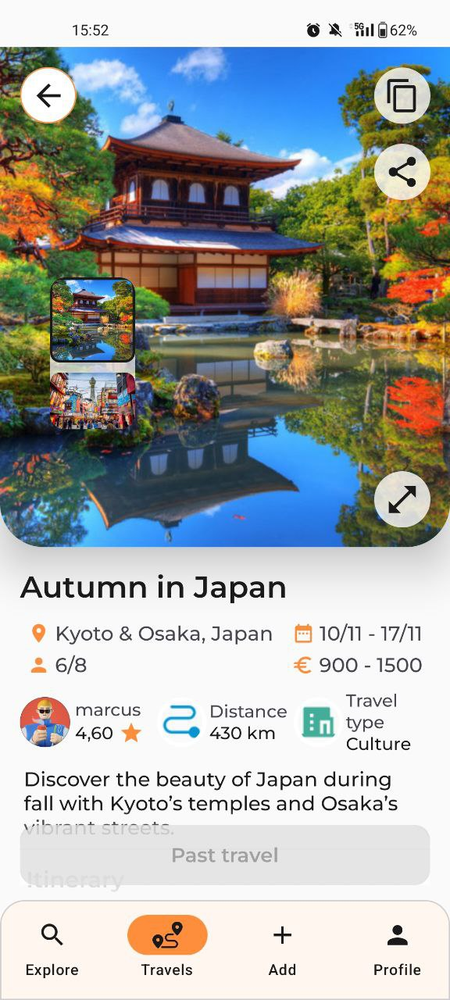
  </figure>

#### Creator Mode

  <figure style="width:30%; display: inline-block; text-align: center; margin: 0 10px;">
    <figcaption style="font-size: 1.1em; font-style: italic;">travels my trips</figcaption>
    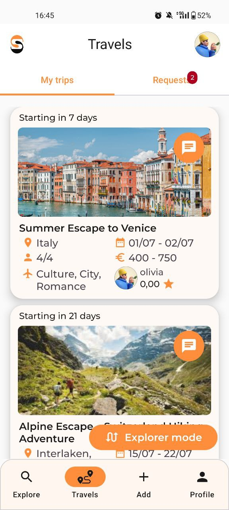
  </figure>
  <figure style="width:30%; display: inline-block; text-align: center; margin: 0 10px;">
    <figcaption style="font-size: 1.1em; font-style: italic;">travel my trip view</figcaption>
    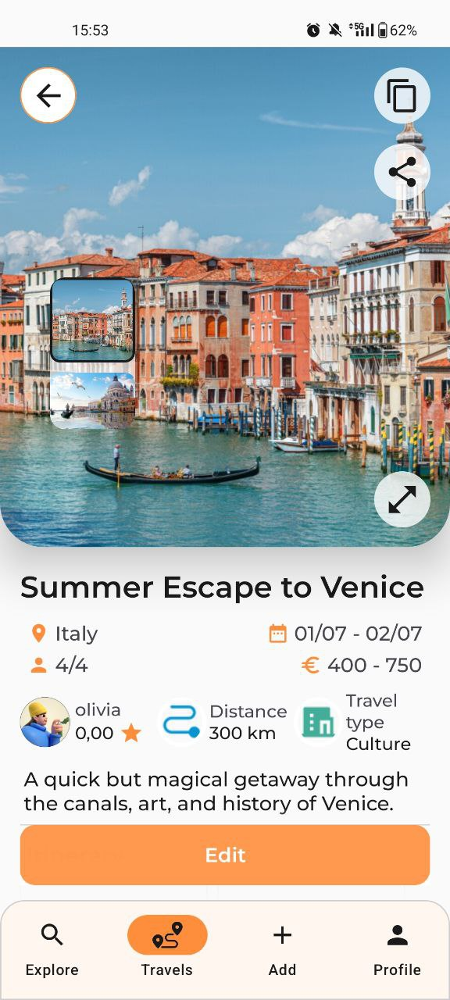
  </figure>

  <figure style="width:30%; display: inline-block; text-align: center; margin: 0 10px;">
    <figcaption style="font-size: 1.1em; font-style: italic;">travel my trip edit</figcaption>
    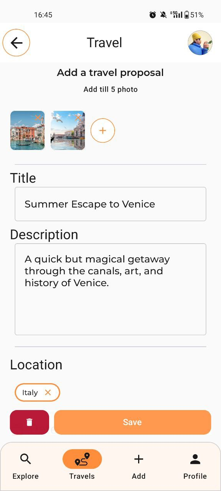
  </figure>
  <figure style="width:30%; display: inline-block; text-align: center; margin: 0 10px;">
    <figcaption style="font-size: 1.1em; font-style: italic;">travel my trip delete</figcaption>
    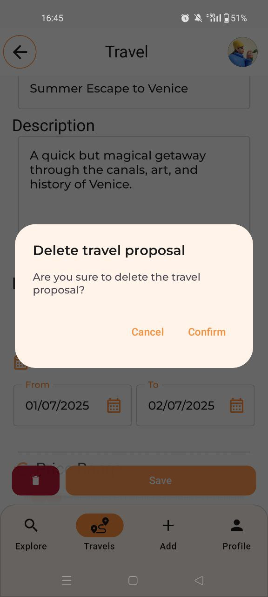
  </figure>

  <figure style="width:30%; display: inline-block; text-align: center; margin: 0 10px;">
    <figcaption style="font-size: 1.1em; font-style: italic;">travels requests</figcaption>
    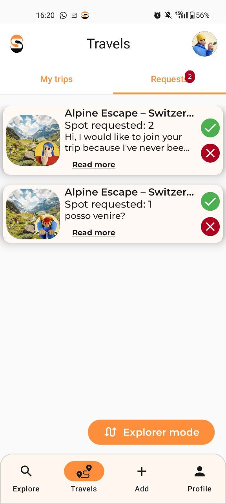
  </figure>
  <figure style="width:30%; display: inline-block; text-align: center; margin: 0 10px;">
    <figcaption style="font-size: 1.1em; font-style: italic;">travel request view</figcaption>
    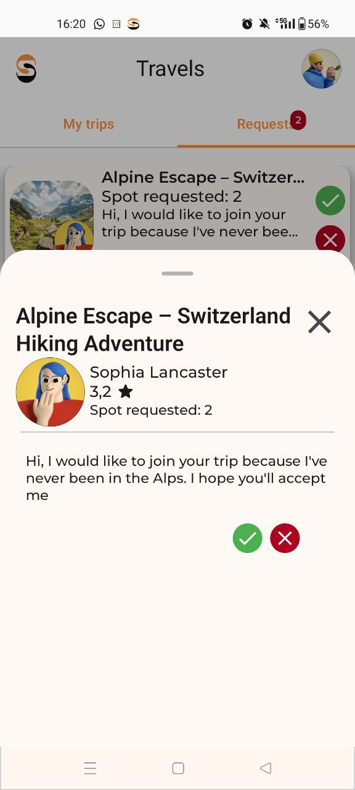
  </figure>

### Add travel proposal Tab

  <figure style="width:30%; display: inline-block; text-align: center; margin: 0 10px;">
    <figcaption style="font-size: 1.1em; font-style: italic;">add travel</figcaption>
    
  </figure>
  <figure style="width:30%; display: inline-block; text-align: center; margin: 0 10px;">
    <figcaption style="font-size: 1.1em; font-style: italic;">add itinerary</figcaption>
    
  </figure>

### Profile Tab

  <figure style="width:30%; display: inline-block; text-align: center; margin: 0 10px;">
    <figcaption style="font-size: 1.1em; font-style: italic;">profile</figcaption>
    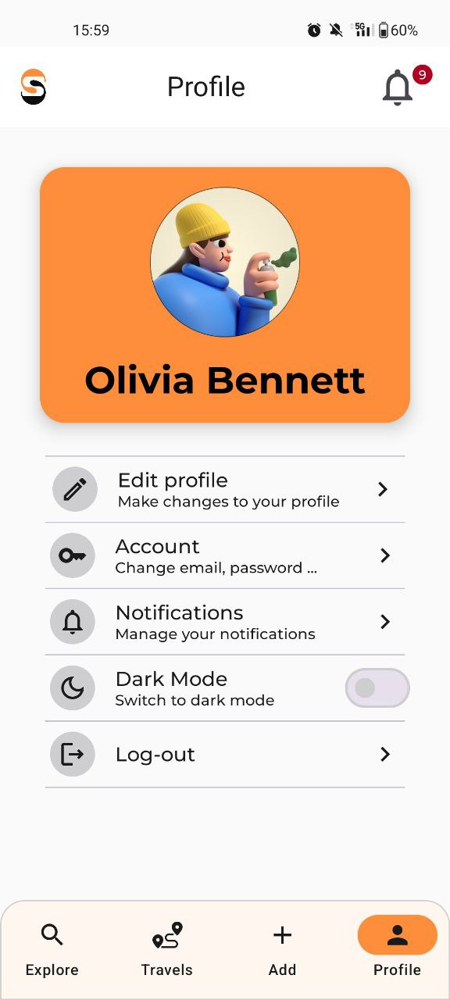
  </figure>
  <figure style="width:30%; display: inline-block; text-align: center; margin: 0 10px;">
    <figcaption style="font-size: 1.1em; font-style: italic;">profile dark mode</figcaption>
    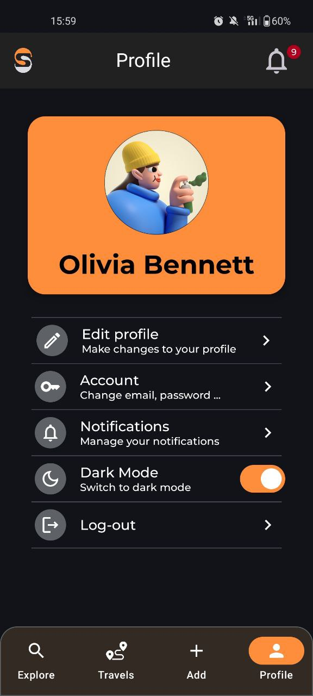
  </figure>

  <figure style="width:30%; display: inline-block; text-align: center; margin: 0 10px;">
    <figcaption style="font-size: 1.1em; font-style: italic;">profile notifications</figcaption>
    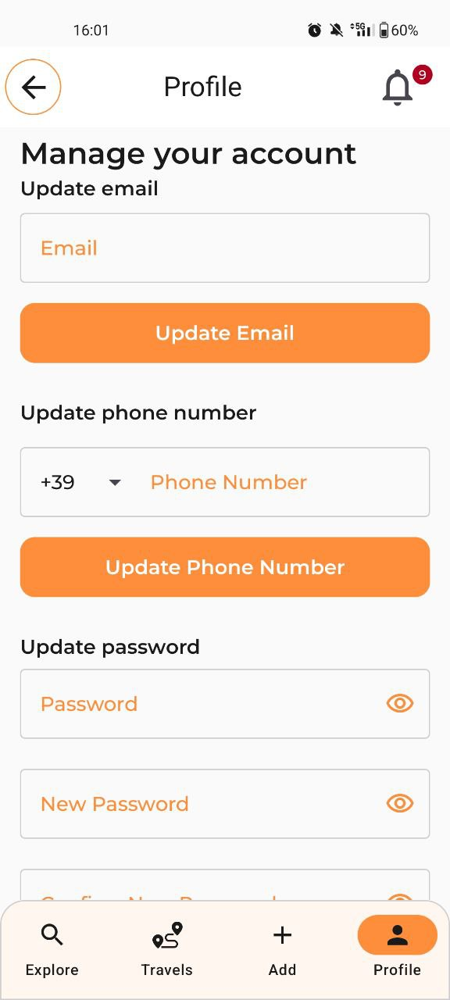
  </figure>

  <figure style="width:30%; display: inline-block; text-align: center; margin: 0 10px;">
    <figcaption style="font-size: 1.1em; font-style: italic;">profile edit</figcaption>
    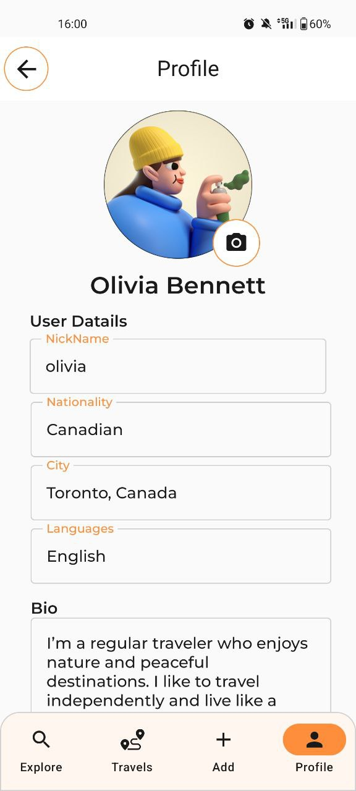
  </figure>
  <figure style="width:30%; display: inline-block; text-align: center; margin: 0 10px;">
    <figcaption style="font-size: 1.1em; font-style: italic;">profile account</figcaption>
    
  </figure>

