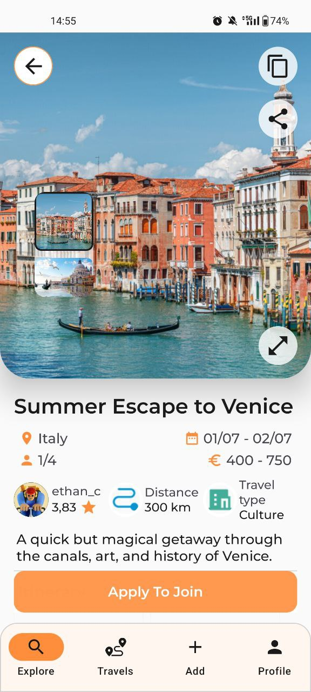
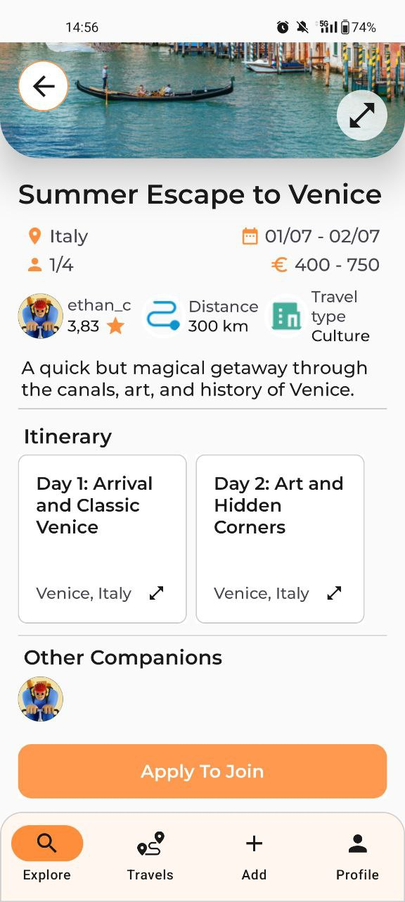
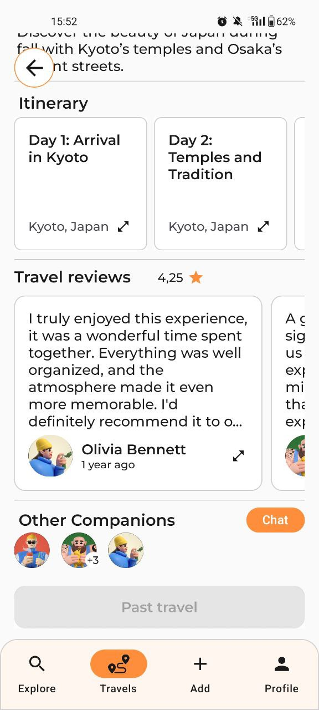
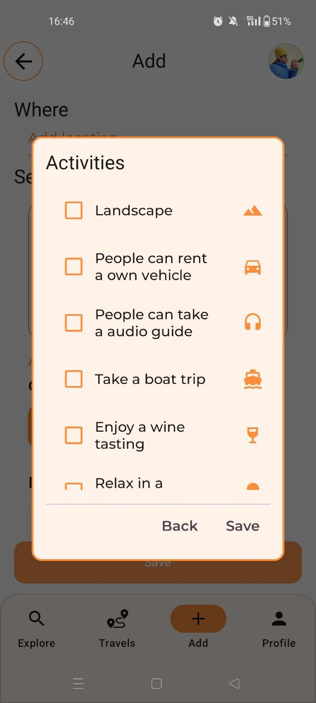

# App Demo 

video and screenshots made from android phone
 
android 14, OnePlus Nord 2T 5G (6,43 pollici)

## App Demonstration Video

<a target="_blank"
  href="https://github.com/VRatPolito/final-assignment-even-g10/blob/main/docs/assets/video_app.mp4">
  GitHub location
</a>

<video width="600" controls>
  <source src="./assets/video_app.mp4" type="video/mp4">
</video>
 
 

## App Screens 

### Auth

  <figure style="width:30%; display: inline-block; text-align: center; margin: 0 10px;">
    <figcaption style="font-size: 1.1em; font-style: italic;">Sign in</figcaption>
    
  </figure>
  <figure style="width:30%; display: inline-block; text-align: center; margin: 0 10px;">
    <figcaption style="font-size: 1.1em; font-style: italic;">Sign up</figcaption>
    
  </figure>

### Explore Tab

  <figure style="width:30%; display: inline-block; text-align: center; margin: 0 10px;">
    <figcaption style="font-size: 1.1em; font-style: italic;">Explore</figcaption>
    
  </figure>
  <figure style="width:30%; display: inline-block; text-align: center; margin: 0 10px;">
    <figcaption style="font-size: 1.1em; font-style: italic;">Filters</figcaption>
    
  </figure>

  <figure style="width:30%; display: inline-block; text-align: center; margin: 0 10px;">
    <figcaption style="font-size: 1.1em; font-style: italic;">Explore travel</figcaption>
    
  </figure>
  <figure style="width:30%; display: inline-block; text-align: center; margin: 0 10px;">
    <figcaption style="font-size: 1.1em; font-style: italic;">Explore travel share</figcaption>
    
  </figure>
  <figure style="width:30%; display: inline-block; text-align: center; margin: 0 10px;">
    <figcaption style="font-size: 1.1em; font-style: italic;">Apply to join</figcaption>
    
  </figure>

  <figure style="width:30%; display: inline-block; text-align: center; margin: 0 10px;">
    <figcaption style="font-size: 1.1em; font-style: italic;">Explore travel</figcaption>
    
  </figure>
  <figure style="width:30%; display: inline-block; text-align: center; margin: 0 10px;">
    <figcaption style="font-size: 1.1em; font-style: italic;">Explore travel itinerary</figcaption>
    
  </figure>
  <figure style="width:30%; display: inline-block; text-align: center; margin: 0 10px;">
    <figcaption style="font-size: 1.1em; font-style: italic;">Explore travel images</figcaption>
    
  </figure>

  <figure style="width:30%; display: inline-block; text-align: center; margin: 0 10px;">
    <figcaption style="font-size: 1.1em; font-style: italic;">View profile</figcaption>
    
  </figure>
  <figure style="width:30%; display: inline-block; text-align: center; margin: 0 10px;">
    <figcaption style="font-size: 1.1em; font-style: italic;">View profile review</figcaption>
    
  </figure>

### Travels Tab

#### Explorer Mode

  <figure style="width:30%; display: inline-block; text-align: center; margin: 0 10px;">
    <figcaption style="font-size: 1.1em; font-style: italic;">Travels upcoming</figcaption>
    
  </figure>
  <figure style="width:30%; display: inline-block; text-align: center; margin: 0 10px;">
    <figcaption style="font-size: 1.1em; font-style: italic;">Travel upcoming view</figcaption>
    
  </figure>
  <figure style="width:30%; display: inline-block; text-align: center; margin: 0 10px;">
    <figcaption style="font-size: 1.1em; font-style: italic;">Travel upcoming view msg</figcaption>
    
  </figure>

  <figure style="width:30%; display: inline-block; text-align: center; margin: 0 10px;">
    <figcaption style="font-size: 1.1em; font-style: italic;">Travels pending</figcaption>
    
  </figure>
  <figure style="width:30%; display: inline-block; text-align: center; margin: 0 10px;">
    <figcaption style="font-size: 1.1em; font-style: italic;">Travel pending view</figcaption>
    
  </figure>

  <figure style="width:30%; display: inline-block; text-align: center; margin: 0 10px;">
    <figcaption style="font-size: 1.1em; font-style: italic;">Travels rejected</figcaption>
    
  </figure>
  <figure style="width:30%; display: inline-block; text-align: center; margin: 0 10px;">
    <figcaption style="font-size: 1.1em; font-style: italic;">Travel rejected view</figcaption>
    
  </figure>

  <figure style="width:30%; display: inline-block; text-align: center; margin: 0 10px;">
    <figcaption style="font-size: 1.1em; font-style: italic;">Travels to review</figcaption>
    
  </figure>
  <figure style="width:30%; display: inline-block; text-align: center; margin: 0 10px;">
    <figcaption style="font-size: 1.1em; font-style: italic;">Review travel</figcaption>
    
  </figure>
  <figure style="width:30%; display: inline-block; text-align: center; margin: 0 10px;">
    <figcaption style="font-size: 1.1em; font-style: italic;">Review companion</figcaption>
    
  </figure>

  <figure style="width:30%; display: inline-block; text-align: center; margin: 0 10px;">
    <figcaption style="font-size: 1.1em; font-style: italic;">Travels past</figcaption>
    
  </figure>
  <figure style="width:30%; display: inline-block; text-align: center; margin: 0 10px;">
    <figcaption style="font-size: 1.1em; font-style: italic;">Travel past view</figcaption>
    
  </figure>
  <figure style="width:30%; display: inline-block; text-align: center; margin: 0 10px;">
    <figcaption style="font-size: 1.1em; font-style: italic;">Travel past view review</figcaption>
    
  </figure>

#### Creator Mode

  <figure style="width:30%; display: inline-block; text-align: center; margin: 0 10px;">
    <figcaption style="font-size: 1.1em; font-style: italic;">Travels my trips</figcaption>
    
  </figure>
  <figure style="width:30%; display: inline-block; text-align: center; margin: 0 10px;">
    <figcaption style="font-size: 1.1em; font-style: italic;">Travel my trip view</figcaption>
    
  </figure>

  <figure style="width:30%; display: inline-block; text-align: center; margin: 0 10px;">
    <figcaption style="font-size: 1.1em; font-style: italic;">Travel my trip edit</figcaption>
    
  </figure>
  <figure style="width:30%; display: inline-block; text-align: center; margin: 0 10px;">
    <figcaption style="font-size: 1.1em; font-style: italic;">Travel my trip delete</figcaption>
    
  </figure>

  <figure style="width:30%; display: inline-block; text-align: center; margin: 0 10px;">
    <figcaption style="font-size: 1.1em; font-style: italic;">Travels requests</figcaption>
    
  </figure>
  <figure style="width:30%; display: inline-block; text-align: center; margin: 0 10px;">
    <figcaption style="font-size: 1.1em; font-style: italic;">Travel request view</figcaption>
    
  </figure>
  <figure style="width:30%; display: inline-block; text-align: center; margin: 0 10px;">
    <figcaption style="font-size: 1.1em; font-style: italic;">Travel request accept</figcaption>
    
  </figure>

### Add travel proposal Tab

  <figure style="width:30%; display: inline-block; text-align: center; margin: 0 10px;">
    <figcaption style="font-size: 1.1em; font-style: italic;">Add travel</figcaption>
    
  </figure>
  <figure style="width:30%; display: inline-block; text-align: center; margin: 0 10px;">
    <figcaption style="font-size: 1.1em; font-style: italic;">Add travel image</figcaption>
    
  </figure>
  <figure style="width:30%; display: inline-block; text-align: center; margin: 0 10px;">
    <figcaption style="font-size: 1.1em; font-style: italic;">Add travel</figcaption>
    
  </figure>

  <figure style="width:30%; display: inline-block; text-align: center; margin: 0 10px;">
    <figcaption style="font-size: 1.1em; font-style: italic;">add itinerary</figcaption>
    
  </figure>
    <figure style="width:30%; display: inline-block; text-align: center; margin: 0 10px;">
    <figcaption style="font-size: 1.1em; font-style: italic;">add activity</figcaption>
    
  </figure>

### Profile Tab

  <figure style="width:30%; display: inline-block; text-align: center; margin: 0 10px;">
    <figcaption style="font-size: 1.1em; font-style: italic;">Profile tab</figcaption>
    
  </figure>
  <figure style="width:30%; display: inline-block; text-align: center; margin: 0 10px;">
    <figcaption style="font-size: 1.1em; font-style: italic;">Profile dark mode</figcaption>
    
  </figure>
  <figure style="width:30%; display: inline-block; text-align: center; margin: 0 10px;">
    <figcaption style="font-size: 1.1em; font-style: italic;">Profile notifications</figcaption>
    
  </figure>

  <figure style="width:30%; display: inline-block; text-align: center; margin: 0 10px;">
    <figcaption style="font-size: 1.1em; font-style: italic;">Profile edit</figcaption>
    
  </figure>
  <figure style="width:30%; display: inline-block; text-align: center; margin: 0 10px;">
    <figcaption style="font-size: 1.1em; font-style: italic;">Profile account</figcaption>
    
  </figure>
  <figure style="width:30%; display: inline-block; text-align: center; margin: 0 10px;">
    <figcaption style="font-size: 1.1em; font-style: italic;">Profile notifications</figcaption>
    
  </figure>

