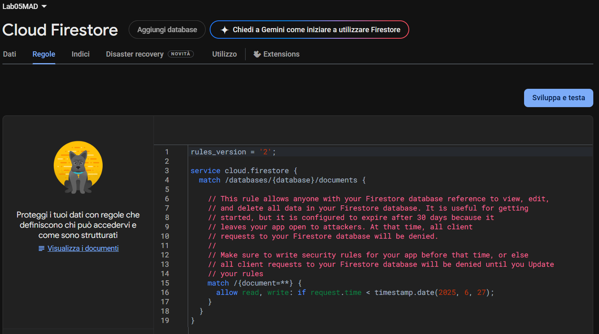

# 🔥 Firebase console

## Firestore Database

[More Details on DB data structure](./Firestore_DB_structure.md)

 

## Authentication

## Storage

File system structure on Firebase Storage:

- pics/
  - profile/
    - {image files}
  - travels/
    - t_{travelId}/
      - travelImages/
        - {image files}
      - reviewImages/
        - r_{dateReview}/
          - {image files}

## Functions

| Function Name                          | Implementation  |
|----------------------------------------|-----------------|
| travelStatus_checkStartDay             | Scheduled, update the travel status to past if it is ended, if a request for a travel started has been ignored it is set to refused |
| travelStatus_checkOnUpdate             | Trigger on Travels, update the travel status  |
| notifications_create_last_minute_join  | Scheduled, filter travel proposals with incoming departure and aviable spots, eventually inserts on User document a notification of type "last_minute_join" |
| notifications_create_my_profile_review | Trigger on Profile, eventually inserts on User document a notification of type "my_profile_review" |
| notifications_create_my_travel_review  | Trigger on Travel, eventually inserts on the creator of the travel proposal (User document) a notification of type "my_travel_review"  |
| notifications_create_requestsNot       | Trigger on Requests, eventually inserts either; on the creator of the travel proposal (User document) a notification of type "manage_apply", on the author of the request (User document) a notification of type "request_accepted" or "request_denied"   |
| notifications_send                     | Trigger on Users, eventually uses Firebase Cloud Messagging to send a notification just added to the User document |

